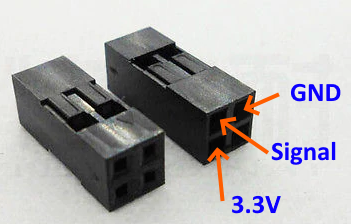
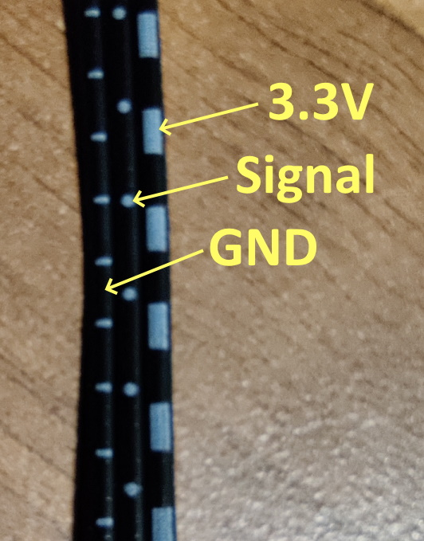

General notes for the BIGTREETECH Smart Filament Sensor

===

## Connecting to an OctoPrint host on a RaspberryPi


### Physical Connections

Cut off the plug on the supplied cable. Note that the sensor-end is a 4-pin connector, and the host-end is a 3-pin connector. Cut off near the 3-pin end.

Depending on what pins are available on your Pi host, find a suitable combination of GND, 3.3V and GPIO. Pins 17, 18, 19 and 20 form a convenient compact square, so I used those.

These are the pins on a Pi:


These are the four I chose:


I used a 2x2 pin-header cable-to-board female plug like this [M20-Series connector housing](https://uk.farnell.com/harwin/m20-1070200/crimp-housing-2-2way/dp/865692):



The 3 wires for the sensor are all black, but have white markings to identify them



Mount the sensor somewhere between the output of the extruder and the input of the hot-end using a suitable length of bowden. If you choose to mount the sensor to the printer frame, just make sure there's enough bowden tube at both ends to allow for the full range of motion of the X and Z axes.

(RaspberryPi pinout diagrams from https://www.raspberrypi.org/documentation/usage/gpio/)

### Verify it's working

My version of WiringPi was a bit out of date so I couldn't easily test the GPIO pins, so if necessary update it:

```bash
cd /tmp
wget https://project-downloads.drogon.net/wiringpi-latest.deb
sudo dpkg -i wiringpi-latest.deb
```

If you want to test the sensor, connect to the RaspberryPi over ssh and use the following commands in the terminal.

```bash
gpio mode 5 input
gpio read 5
```

You can list all your pins and different ways they are named with `gpio readall`:

```bash
gpio readall
 +-----+-----+---------+------+---+---Pi 4B--+---+------+---------+-----+-----+
 | BCM | wPi |   Name  | Mode | V | Physical | V | Mode | Name    | wPi | BCM |
 +-----+-----+---------+------+---+----++----+---+------+---------+-----+-----+
 |     |     |    3.3v |      |   |  1 || 2  |   |      | 5v      |     |     |
 |   2 |   8 |   SDA.1 |   IN | 1 |  3 || 4  |   |      | 5v      |     |     |
 |   3 |   9 |   SCL.1 |   IN | 1 |  5 || 6  |   |      | 0v      |     |     |
 |   4 |   7 | GPIO. 7 |   IN | 1 |  7 || 8  | 1 | IN   | TxD     | 15  | 14  |
 |     |     |      0v |      |   |  9 || 10 | 1 | IN   | RxD     | 16  | 15  |
 |  17 |   0 | GPIO. 0 |   IN | 0 | 11 || 12 | 0 | IN   | GPIO. 1 | 1   | 18  |
 |  27 |   2 | GPIO. 2 |   IN | 0 | 13 || 14 |   |      | 0v      |     |     |
 |  22 |   3 | GPIO. 3 |   IN | 0 | 15 || 16 | 0 | IN   | GPIO. 4 | 4   | 23  |
 |     |     |    3.3v |      |   | 17 || 18 | 0 | IN   | GPIO. 5 | 5   | 24  |
 |  10 |  12 |    MOSI |   IN | 0 | 19 || 20 |   |      | 0v      |     |     |
 |   9 |  13 |    MISO |   IN | 0 | 21 || 22 | 0 | IN   | GPIO. 6 | 6   | 25  |
 |  11 |  14 |    SCLK |   IN | 0 | 23 || 24 | 1 | IN   | CE0     | 10  | 8   |
 |     |     |      0v |      |   | 25 || 26 | 1 | IN   | CE1     | 11  | 7   |
 |   0 |  30 |   SDA.0 |   IN | 1 | 27 || 28 | 1 | IN   | SCL.0   | 31  | 1   |
 |   5 |  21 | GPIO.21 |   IN | 1 | 29 || 30 |   |      | 0v      |     |     |
 |   6 |  22 | GPIO.22 |   IN | 1 | 31 || 32 | 0 | IN   | GPIO.26 | 26  | 12  |
 |  13 |  23 | GPIO.23 |   IN | 0 | 33 || 34 |   |      | 0v      |     |     |
 |  19 |  24 | GPIO.24 |   IN | 0 | 35 || 36 | 0 | IN   | GPIO.27 | 27  | 16  |
 |  26 |  25 | GPIO.25 |   IN | 0 | 37 || 38 | 0 | IN   | GPIO.28 | 28  | 20  |
 |     |     |      0v |      |   | 39 || 40 | 0 | IN   | GPIO.29 | 29  | 21  |
 +-----+-----+---------+------+---+----++----+---+------+---------+-----+-----+
 | BCM | wPi |   Name  | Mode | V | Physical | V | Mode | Name    | wPi | BCM |
 +-----+-----+---------+------+---+---Pi 4B--+---+------+---------+-----+-----+
```

From the earlier pinout diagram I used physical pins 17-20 for the sensor, and specifically pin 18 for the signal.

```bash
+---Pi 4B--+---+------+---------+-----+-----+
| Physical | V | Mode | Name    | wPi | BCM |
+----++----+---+------+---------+-----+-----+
     || 18 | 0 | IN   | GPIO. 5 | 5   | 24  |
```

Pin 18 here has a "wPi" name of 5 and a BCM name of 24. Later on we'll need the wPi name.


## OctoPrint Setup

First work out what the correct load and unload distances for your setup. The easiest way to do this is:

1. get the printer pre-heated to printing temperatures.
1. manually push filament until it just clears the top of the extruder.
1. issue feed GCODE commands until the filament has extruded 20mm out of the hot-end. Make a note of the total fed distance. For example, this loads 100mm of filament:
    ```
    G91
    G1 E100 F2400
    ```
1. issue reverse feed GCODE commands until the filament has returned to just above the position where you can remove it. Make a note of the total fed distance. For example, this unloads 100mm of filament:
    ```
    G91
    G1 E-100 F2400
    ```
1. save the load and unload values into the settings permanently to EEPROM. For example, this saves a load distance of 538mm and an unload distance of 555mm:
    ```
    M603 L538 U555
    M500
    ```
1. test the calibration by starting a print
1. part-way through enter `M600` into the console. The printer should stop and unload the filament
1. cut off and remove the filament
1. load in a new filament as far as you did in #2
1. enter an `M108` command into the console to resume printing

Finally, simply install the Smart Filament Sensor plugin and reboot the RaspberryPi. Set the "Motion Sensor GPIO pin" to `5`.
When the plugin detects a failure, it will unload old filament and wait for you to load in the new one.

## Shopping List

| Item | Link |
| ---- | ---- |
| Marlin 2.0 | [GitHub](https://github.com/davidramiro/Marlin-Ai3M-2.0.x)
| BIGTREETECH Smart Filament Sensor | [Amazon](https://www.amazon.co.uk/dp/B07Z7Y5VY9), [AliExpress](https://www.aliexpress.com/i/4000269547406.html)
| 2x2 Pin-Header Connector Housing | [Farnell M20-Series](https://uk.farnell.com/harwin/m20-1070200/crimp-housing-2-2way/dp/865692), [Hobbytronics Crimp Connector Housing](https://www.hobbytronics.co.uk/crimp-conn-housing-22?keyword=crimp%202x2)
| Bowden tube | [Amazon](https://www.amazon.co.uk/dp/B06XWYM4Y4)