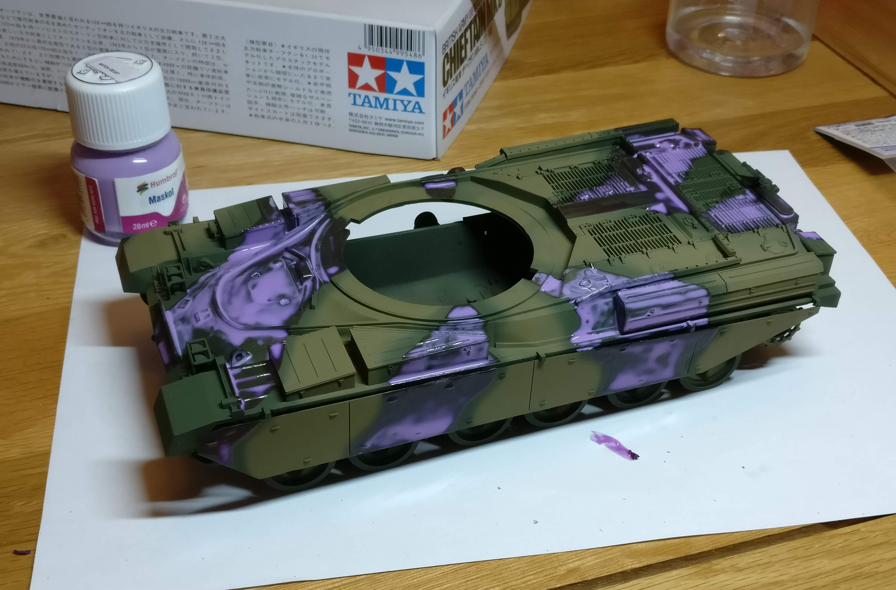
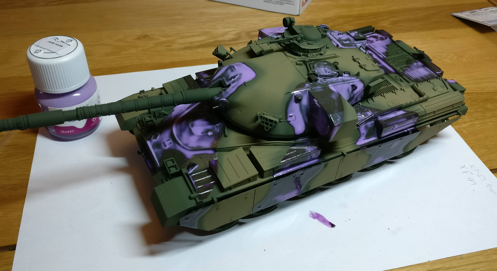

With the intention of getting back into some miniature diorama stuff, I've recently picked
up a Tamiya British Army Chieftain MK.5 tank kit. This is the progress so far...

===

## Base Construction

Not much to say here. Just a picture of the sprues :)

## Basecoating

This is just a simple, flat application of some Tamiya `XF-67 NATO Green` to add a base colour and something for later paint to key to.

## Adding Some Camouflage
 

Here I've sprayed on a few stripes of Tamiya `XF-49 Khaki`. Things are still pretty flat at this point, but this is really still just a basecoat. Hopefully with a bit of detailing it will all come together. The end-game here is to have this tank pretty grungy anyway.

## Adding some more Camouflage
 
Next I applied the "Hiding in an Irradiated Swamp" camo colours.
