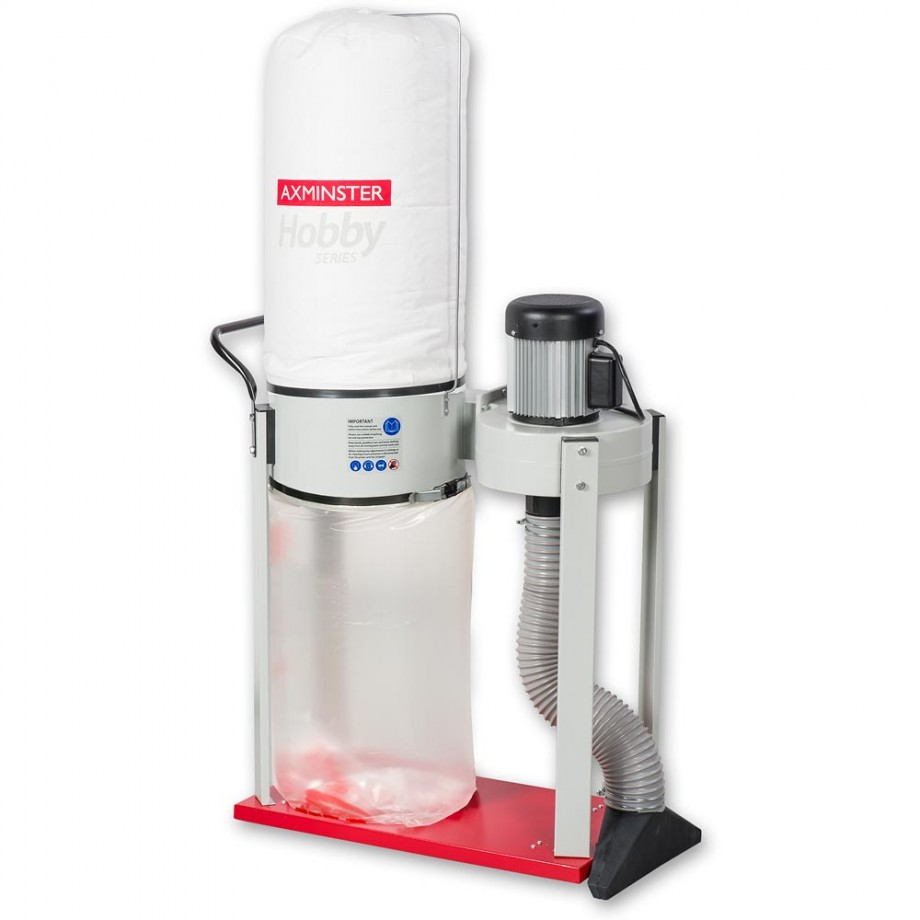

Axminster Hobby Series AWEDE2 Extractor

* £215.36 : [Axminster AWEDE2](https://www.axminster.co.uk/axminster-hobby-series-awede2-extractor-501263)
* £11.46 : [Axminster Dust Extractor Waste Sack x10](https://www.axminster.co.uk/axminster-dust-extractor-waste-sack-560mm-x-915mm-red-pkt-10-340068)
* £9.59 : [AWEDE2 Fine Filter Bag](https://www.axminster.co.uk/awede2-fine-filter-bag-500079)
===

* Small, portable chip extractor for small hobby workshops
* 850m3/hr air flow, 0.75kW 230V 1ph induction motor
* 100mm hose fits directly to many saws, planers, bandsaws etc
* Wheeled base and grab handle for ease of movement
* An attachment provided to enable easy floor cleaning of wood chips
* Uses waste sack size - 560 x 915mm (340068)
