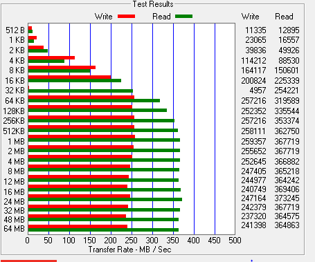
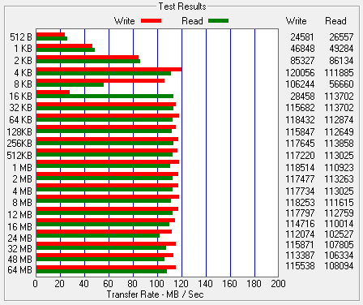
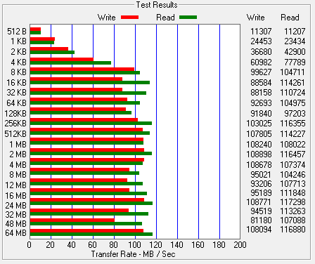
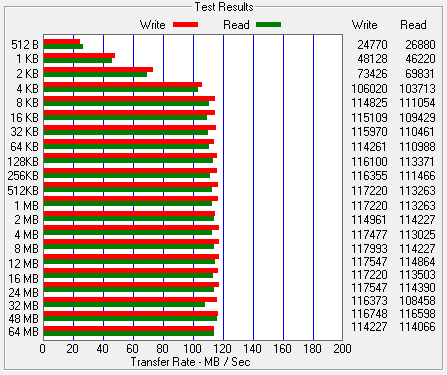

## C: 111.31 GB SSD - OCZ-VERTEX3

## G: 465.63 GB HDD - Hitachi HDT725050VLA360

## E: 931.39 GB HDD - Samsung HD103SJ

## F: 1863.01 GB HDD - WDC WD20EARX-32PASB0

## I: 1863.01 GB HDD - Samsung HD204UI

